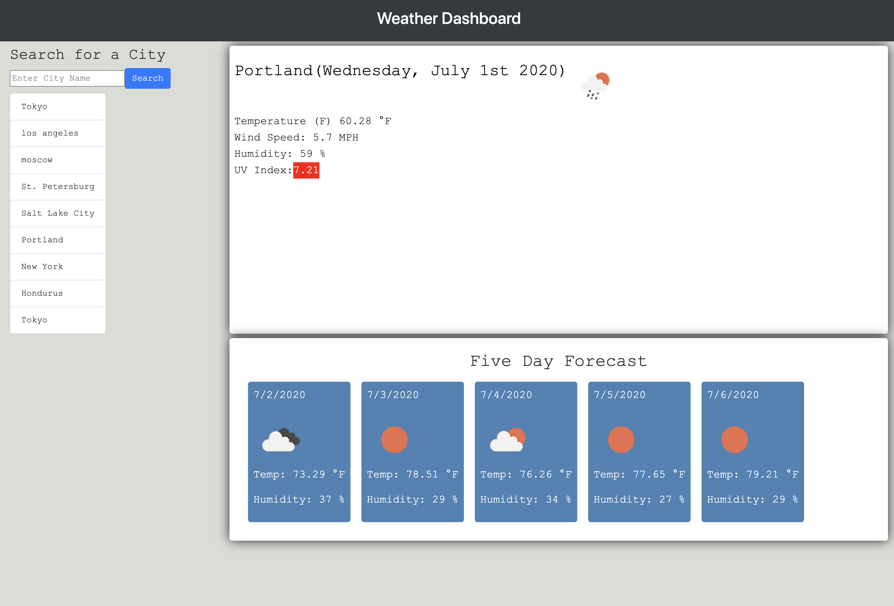

# Weather_Dashboard_Assign6

# Purpose:
The purpose of this assignment was to create a weather forecast scheduler that would show the humidity, temperature, wind speed, and uv index of the location the user searches. It will also show a five day forecast of searched location, and save the location in a row with other searched cities. Upon re-entering the site the user would be presented with a display of their last searched location. I built this project to apply my newfound knowledge in Javascript, Jquery, and server-side API's. 

# Process:
* First I developed the html and css, trying to build a display similar to the example provided. 
* I then copied the code for the moment.js and pasted it into its own javascript file so that I could display the current day, as well as the dates for the next five days in the forecast.
* I then used the ready function to make sure that the website would not display any part of thhe forecast until everything was ready. 
* I then built two click functions that will search from the user's typed answer in the form, or search from a previously searched location. 
* I then used localStorage with JSON stringify and parse to save the written location and display it in the favorite cities display. 
* Then I used two ajax pulls to take the api of openweathermap and manipulate it within the javascript (I needed to use a second pull in order to search by longitude and latitude because it is required to find the uv index)
* I then used javascipt to display the temp, humidity, wind speed, weather icon, and uv index. With the uv index I did if, else if, and else commands to color-code the index.  

# Problems I Encountered:
* A major issue I encountered was that if the user chose a location from their favorite list, it would replicate the box again, creating a series of clone boxes. In order to resolve this, with the help of an instructional assistant I created an event within the developWeather function that only responds when the user enters info in the search form. 
* Another issue was that in the forecast, the icons were just copies of the original icon. In order to fix this I needed to use response.daily[i].weather[0].icon.
* When publishing the website, the functionality no longer worked because there was no location information saved within the localStorage. In order to fix this, I set up a default item in localStorage so that there always be something to display.

# What I Learned:
* How to use a server-side api
* How to use events within a function in order to dictate when to run other functions
* How to set up clauses so that localstorage will have a default

# Link: 
https://corvus-cyber.github.io/Weather_Dashboard_Assign6/

# Screenshot: 
